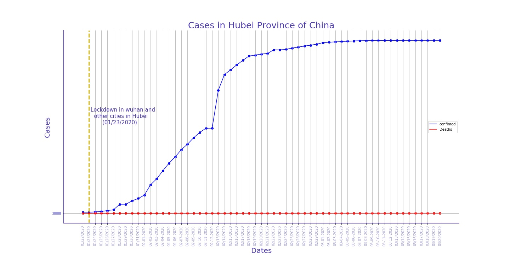
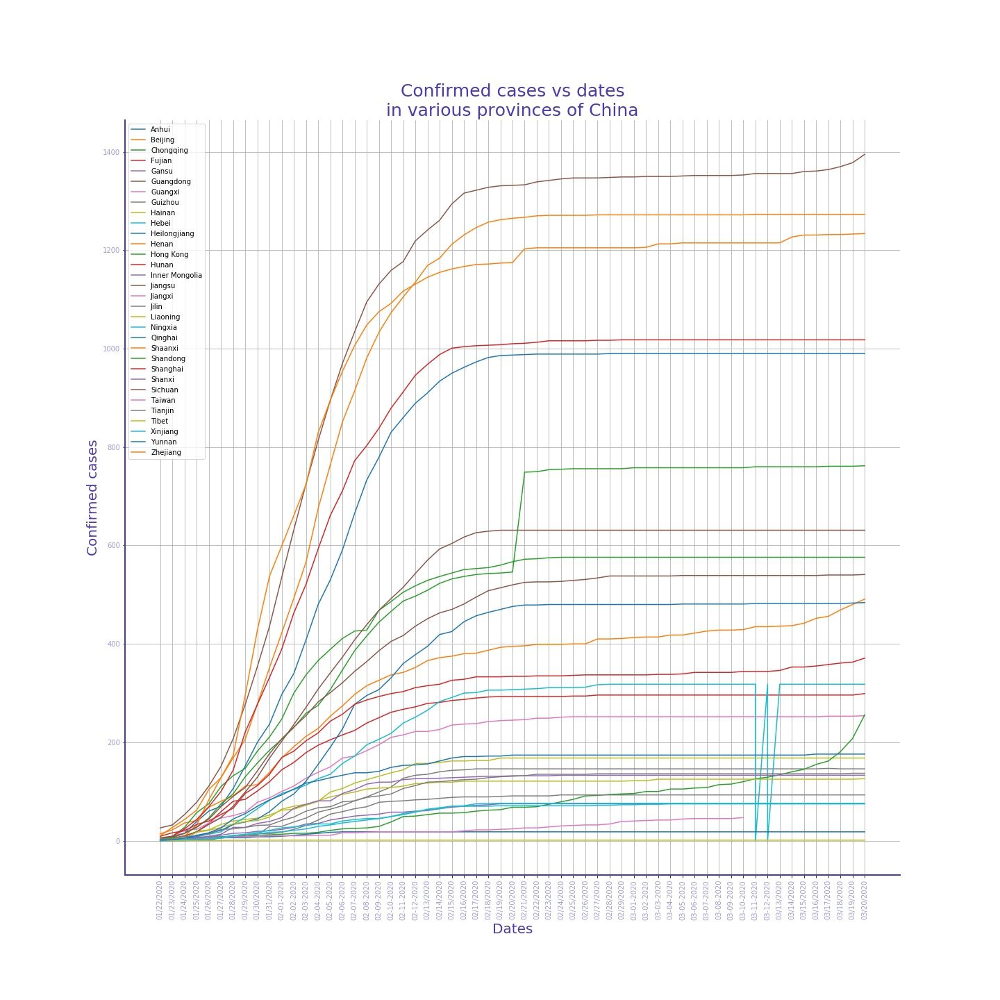
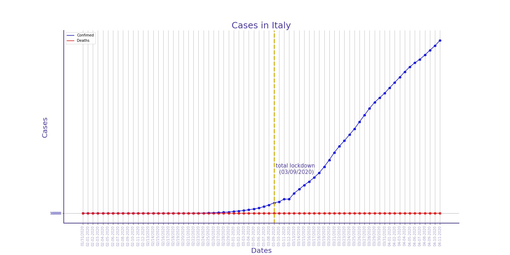
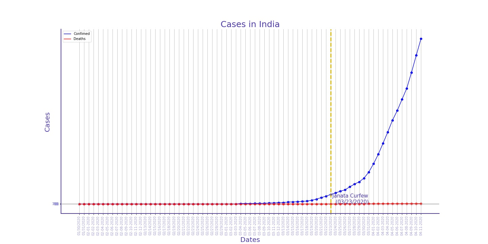
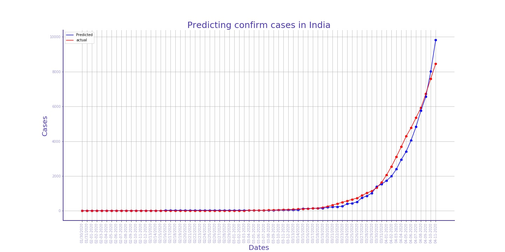
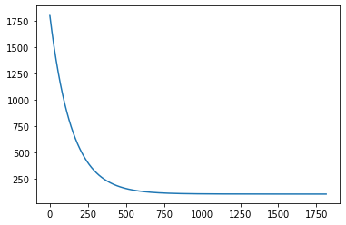

# covid19datastudy
This this a basic study about the ongoing covid situation in India as well as few of the worst affected places in the world.
## China
Hubei province in China initially got affected by it and its affected levels can be clearly seen in the image below. with an exponential increase in the number of cases the things came to an stability in the increase after reaching a saturation point at around 17th Feb, 2020. 

as displayed in the graph the lockdown was declared here from 23 jan 2020 but however till then already the carriers has been developed and high increase in the rate of confirmed cases is seen.

The various provionces within China which got affected are shown in the following distribution.

At current moment China's condition is stable with a net of 84,547 confirmed cases 4,645 deaths  and 78,288 recovered individuals
(the data provided here is till 20-03-2020)

## Italy
italy was quick to still headlines as the number of covid cases increased exponentially there too.
the lockdown was followed from 9th of March but however soon the numbers got real high

at the current moment Italy is relatively stable as the rate of increase of cases are  reducing
(the data provided here is till 11-04-2020)

## India
on 30th Jan 2020 India detected its first Covid patient after that India was able to stop the spread by a huge margin for a very long time. Maharastra being the worst affected by the pandemic.The following distribution shows the increase of confirmed cases in India.

we tried to fit a model to increase in the number of confirmed cases in india and we achived the following results

since the number of data is based on the number of day w simply used a linear regression model to fit the data.
as the model trained the reduction in the cost can be seen as below

 
 the learning rate was reduced to 0.0000055 so as to reach the minimum possible cost 
 
## Conclusion
even though the lockdown was placed in many countries the raise of confirm cases didn't reduced this can be due to people not following proper social distancing and resisting the lockdown.
in india specifically as people were transported to various places from the main covid19 affected places it leads to a frequent increase in numbers
(new updates in data of india will be done asap)
